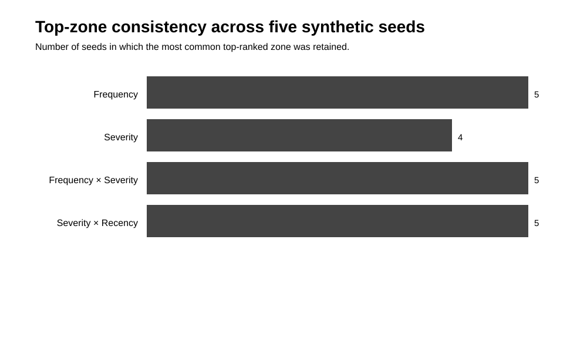
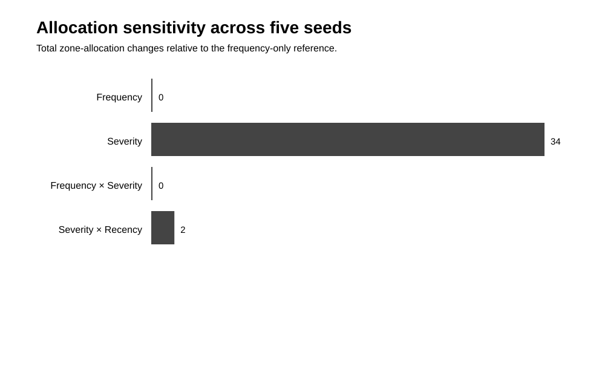
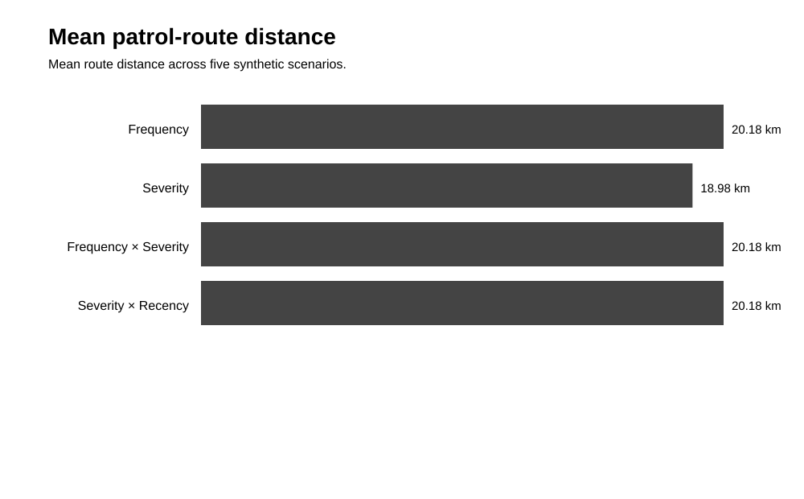
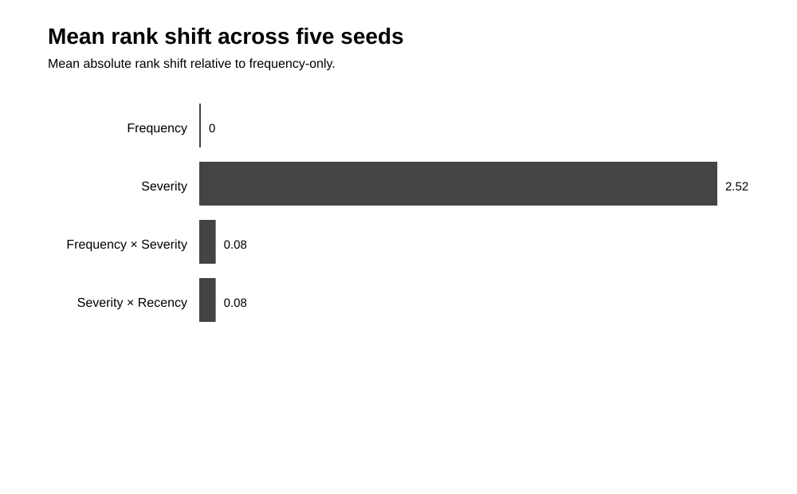

# SurakshyaPath Research

This directory contains the reproducible research record for SurakshyaPath.

## Research question

**How do different, explainable risk-scoring assumptions change geographic prioritization, patrol routing, and resource allocation when evaluated on the same synthetic dataset?**

## Study design

| Component | Current setup |
|---|---|
| Spatial records | 1,567 synthetic incidents |
| Zones | 10 Kathmandu Valley zones |
| Canonical seed | 208304 |
| Robustness seeds | 208304–208308 |
| Risk models | 4 |
| Allocation budget | 12 officers |
| Patrol stops | 5 |
| Routing | Nearest-neighbour + 2-opt comparison |

The study is a **computational sensitivity and robustness experiment**. It does not estimate real-world crime risk or determine an operational policing policy.

## Main results

### 1. Risk-model sensitivity

| Model | Top zone | Rank changes vs frequency | Mean absolute rank shift |
|---|---|---:|---:|
| Frequency-only | Bouddha | 0 | 0.00 |
| Severity-only | Thamel | 7 | 2.80 |
| Frequency × severity | Bouddha | 0 | 0.00 |
| Current severity × recency | Bouddha | 0 | 0.00 |

The severity-only formulation produces the largest change in geographic ordering in this synthetic scenario.

### 2. Resource allocation

| Model | Zones changed vs frequency | Total absolute officer change |
|---|---:|---:|
| Frequency-only | 0 | 0 |
| Severity-only | 6 | 10 |
| Frequency × severity | 0 | 0 |
| Current severity × recency | 0 | 0 |

This demonstrates how a change in the scoring formula can propagate into discrete allocation outputs.

### 3. Patrol routing

| Model | Nearest-neighbour km | 2-opt km | Reduction |
|---|---:|---:|---:|
| Frequency-only | 23.62 | 22.31 | 1.30 km |
| Severity-only | 18.12 | 18.12 | 0.00 km |
| Frequency × severity | 23.62 | 22.31 | 1.30 km |
| Current severity × recency | 23.62 | 22.31 | 1.30 km |

Distances are great-circle coordinate estimates, not road-network travel distances.

### 4. Robustness

Across five deterministic synthetic scenarios:

- Frequency-only selected Bouddha in 5/5 scenarios.
- Frequency × severity selected Bouddha in 5/5 scenarios.
- Current severity × recency selected Bouddha in 5/5 scenarios.
- Severity-only selected Thamel in 4/5 and Chabahil in 1/5.
- Severity-only showed a 1.8–2.8 mean absolute rank-shift range.
- Current severity × recency showed a 0.0–0.2 rank-shift range.

These are replications of the **synthetic generator**, not independent real-world observations.


## Visual results

The generated figures below provide a quick visual view of the four main experiment families. They are generated from the repository's machine-readable outputs and can be regenerated with `npm run figures`.

### Risk-model comparison



This figure shows how the four scoring formulations rank the ten synthetic zones in the canonical scenario.

### Resource-allocation comparison



This figure shows how model-specific scores propagate into the fixed 12-officer allocation.

### Patrol-route comparison



This figure compares the route produced from model-generated priority zones with the 2-opt order improvement.

### Robustness comparison



This figure summarizes how the model outputs vary across the five deterministic synthetic scenarios.

> **Reading the figures:** visual differences are properties of the implemented algorithms and synthetic generator. They should not be interpreted as maps of actual crime risk or evidence for operational deployment.

## Evidence chain

The research record is intentionally traceable:

```
synthetic generator
      ↓
zone assignment
      ↓
risk-model outputs
      ↓
allocation / routing experiments
      ↓
robustness analysis
      ↓
figures + written interpretation
      ↓
validation
```

Each stage can be regenerated from the repository rather than relying on manually edited results.

## Research documents

- [Results](RESULTS.md) — canonical results, robustness, and reproducibility record.
- [Analysis](ANALYSIS.md) — interpretation of the observed computational patterns.
- [Limitations](LIMITATIONS.md) — validity, external-use, and methodological limitations.

## Machine-readable outputs

The raw experiment outputs are stored under [`experiments/results/`](../experiments/results/):

- risk-model CSV files
- allocation comparisons
- patrol-route comparisons
- robustness outputs
- consolidated CSV/JSON summaries

These files are generated by the experiment scripts rather than manually entered.

## Reproduce the study

From the repository root:

```bash
npm install
npm run research
npm run research-experiments
npm run patrol-experiments
npm run allocation-experiments
npm run robustness-experiments
npm run figures
npm run validate
```

The final validation command checks deterministic and internally consistent behavior across the dataset, zone assignment, risk models, allocation, routing, and live-risk calculation.

## Interpretation boundary

The evidence currently supports a **reproducible computational sensitivity study**.

It does not establish:

- actual crime patterns,
- causal relationships,
- statistical significance for Kathmandu Valley,
- patrol effectiveness,
- staffing requirements,
- or a universally preferable risk model.

The strongest next research step is validation against carefully sourced and legally usable data, together with a clearly specified evaluation design.